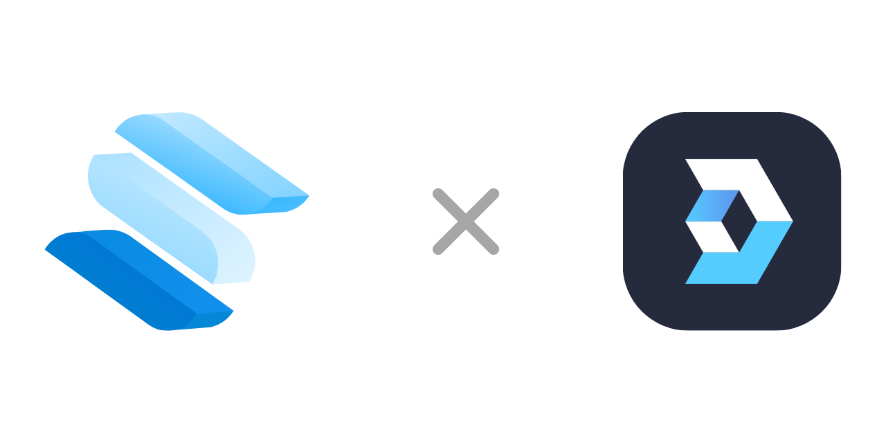

[](https://web3onboard.thirdweb.com)

# SolidStart Example

Everything you need to integrate Web3Onboard in [SolidStart](https://start.solidjs.com)

## Features

- **SSR Compliant**: Web3 code loads only on the client
- **Auth Context**: A reactive context to monitor wallet changes, handle signatures, and more
- **Database**: Includes `unstorage`, a lightweight file-based DB
- **Client-Only**: Easily isolate client-side logic for Web3 interactions

## Getting Started

1. Rename `.env.example` to `.env`. For production, generate a secure `SESSION_SECRET` with

   ```bash
   openssl rand -hex 32
   ```

2. Install dependencies

   ```bash
   # use preferred package manager
   npm install
   ```

3. Run the development server

   ```bash
   # use preferred package manager
   npm run dev
   ```

For more details, refer to SolidStart's [README.md](https://github.com/solidjs/solid-start/blob/main/packages/start/README.md)

## Usage

To ensure Web3-related logic runs only on the client, use the `clientOnly` utility from SolidStart.
Here are two ways to implement client-only code:

1. **In Component** (e.g. for a component showing eth balance)

   ```jsx
   import { clientOnly } from "@solidjs/start/client";

   const ClientComponent = clientOnly(() => import("./ClientOnlyComponent"));
   ```

2. **In Routes** (e.g. for a `/swap` page)

   ```jsx
   import { clientOnly } from "@solidjs/start/client";

   export default clientOnly(async () => ({ default: MyPage }));
   ```

For more details, refer to the `clientOnly` [documentation](https://docs.solidjs.com/solid-start/reference/client/client-only#clientonly).

<div align="center">
  
</div>
